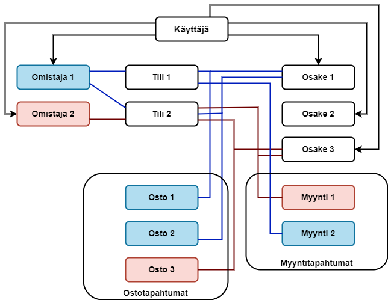
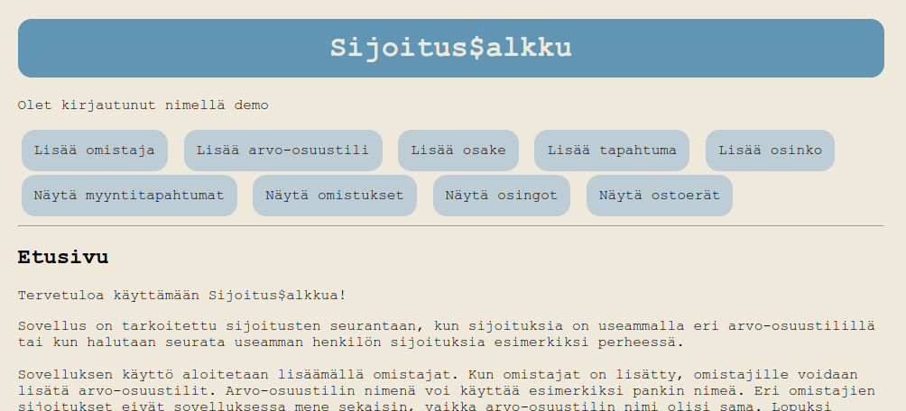

## Sijoitussalkku - sovellus sijoitusten hallintaan
Sovelluksen tarkoitus on säilyttää tietoja sijoituksista ja hyödyntää näitä tietoja veroilmoituksen 
täyttämisessä sekä sijoitusten hallinnoinnissa ja suunnittelussa. 

### Sovelluksen toiminnallisuudet
- Käyttäjä pystyy luomaan käyttäjätunnuksen ja kirjautumaan sovellukseen
- Käyttäjä pystyy lisäämään sovellukseen (sijoitusten) omistajia
- Käyttäjä pystyy lisäämään sovellukseen valitulle omistajalle arvo-osuustilejä
- Käyttäjä pystyy lisäämään sovellukseen osakkeita
- Käyttäjä pystyy lisäämään nimetyn omistajan nimetylle tilille nimetyn osakkeen osto- tai myyntitapahtuman
- Käyttäjä pystyy katsomaan tiedot kaikkien omistajien sijoituksista, eriteltynä omistajakohtaisesti
- Käyttäjä pystyy näkemään, mitkä vuosittaiset osto- ja myyntitapahtumat liittyvät toisiinsa
- Käyttäjä pystyy lisäämään sovellukseen lisätylle osakkeelle vuotuisen osingon määrän
- Käyttäjä pystyy katsomaan tiedot omistajien saamista vuotuisista osingoista, eriteltynä omistajakohtaisesti
- Käyttäjä pystyy katsomaan omistajien hallussa olevat osakkeet ostoerittäin
 
### Sovelluksen toimintaa havainnollistava kaavio


Kaavio kuvaa, kuinka käyttäjän lisäämät Omistajat, Tilit, Osakkeet, Ostotapahtumat ja Myyntitapahtumat kytkeytyvät toisiinsa. Käyttäjän kannattaa edetä sovelluksen käytössä ensimmäisellä kerralla kirjautumisen jälkeen ylempää linkkiriviä pitkin vasemmalta oikealle, jotta pääsee lisäämään tapahtumia ja katsomaan raportteja.


### Sovelluksen käyttö
Sovelluksen käyttö edellyttää projektin lataamista omalle koneelle. Sovellus vaatii toimiakseen myös
Postgres-tietokannan. Lisäksi projektin juureen pitää lisätä tiedosto .env jonka sisällöksi tulee:
```bash
DATABASE_URL=postgresql+psycopg2:///<oma käyttäjätunnus>
SECRET_KEY=<itsemuodostettu salasana>
```
Virtuaaliympäristö käynnistetään komennoilla 
```
python3 -m venv venv
```
```
source venv/bin/activate
```
```
pip install -r requirements.txt
```
Tietokanta alustetaan komennolla
```
psql < schema.sql
```
ja sovellus käynnistyy flaskapp-hakemistotasolta komennolla
```
flask run
```
